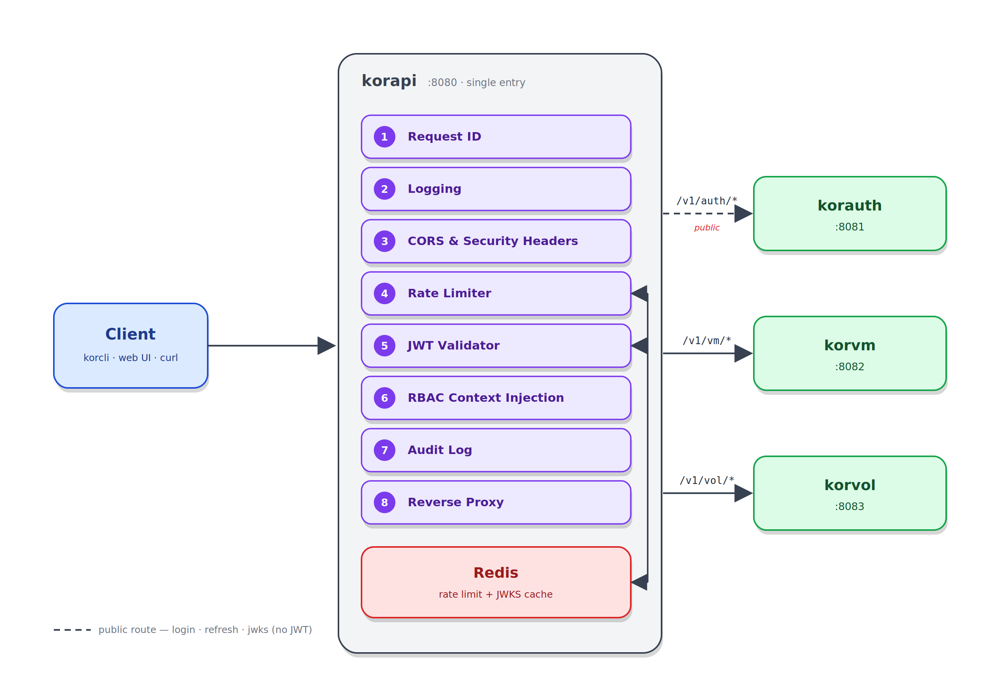

# korapi

> OpenKor — API Gateway. The single external entry point of the platform.

`korapi` is the sole gateway through which all client traffic (korcli, web UI, curl) flows. Backend services (korauth, korvm, korvol) are never exposed directly. The gateway handles routing, JWT validation, rate limiting, audit logging, and request ID propagation — **it contains no business logic**.

**Stack:** Go 1.22+ · Gin · Redis (rate limiting + JWKS cache)  
**License:** Apache 2.0 · **Org:** [OpenKorProject](https://github.com/OpenKorProject)

## Architecture



## Quick start

```bash
# 1. Configure environment
cp .env.example .env
# Update KORAUTH_URL, KORVM_URL, KORVOL_URL with downstream service addresses

# 2. Start development environment (Redis + gateway)
docker-compose up -d

# 3. Gateway is running at http://localhost:8080
curl http://localhost:8080/healthz
```

## Routing

| Path | Target | Auth |
|---|---|---|
| `/v1/auth/login` | korauth | ❌ |
| `/v1/auth/refresh` | korauth | ❌ |
| `/v1/auth/.well-known/jwks.json` | korauth | ❌ |
| `/v1/auth/*` | korauth | ✅ |
| `/v1/vm/*` | korvm | ✅ |
| `/v1/vol/*` | korvol | ✅ |
| `/healthz`, `/readyz` | korapi | ❌ |

Routing is **declarative** (`.env` + code) — adding a new service requires minimal code changes.

## Middleware chain (order matters)

1. **Request ID** — generate if missing, propagate as `X-Request-ID` header
2. **Logging** — start/end, duration, status (stdout JSON)
3. **CORS + security headers**
4. **Rate limiting** — per tenant/IP (Redis sliding window)
5. **JWT validation** — skipped for public paths; validated against korauth JWKS (cached)
6. **RBAC context injection** — extract tenant_id/roles from token → `X-Tenant-ID`, `X-User-ID`, `X-Roles` headers
7. **Audit log** — mutations (POST/PUT/PATCH/DELETE) → stdout JSON
8. **Reverse proxy** — forward to target service

## Project layout

```
cmd/korapi/           # entrypoint
internal/
  config/            # env-based configuration
  handler/           # HTTP handlers (healthz, readyz, 404)
  middleware/        # middleware (request-id, JWT, rate-limit, audit, CORS, etc.)
  proxy/             # reverse proxy logic
  audit/             # audit logging
api/openapi.yaml     # API contract (routing, middleware, error format)
```

## Test & lint

```bash
# Run tests
go test ./...

# Vet
go vet ./...

# Build
go build -o bin/korapi ./cmd/korapi
```

## Deployment

### Docker

```bash
docker build -t korapi:latest .
docker run -p 8080:8080 \
  -e KORAUTH_URL=http://korauth:8081 \
  -e REDIS_URL=redis://redis:6379/0 \
  korapi:latest
```

### Multi-service network

All OpenKor services must share a Docker network so they can reach each other by hostname:

```bash
docker network create openkor
# Add openkor network to each service's docker-compose.yaml
```

### systemd

The service unit file is kept in the repo at `systemd/korapi.service`.

**1. Build the binary**

```bash
go build -o /opt/openkor/korapi/bin/korapi ./cmd/korapi
```

**2. Create the environment file**

```bash
sudo mkdir -p /opt/openkor/korapi/config
sudo cp .env.example /opt/openkor/korapi/config/korapi.env
# Edit /opt/openkor/korapi/config/korapi.env with production values
```

**3. Install the service unit**

```bash
sudo cp systemd/korapi.service /etc/systemd/system/korapi.service
```

**4. Enable and start**

```bash
sudo useradd --system --no-create-home korapi
sudo systemctl daemon-reload
sudo systemctl enable --now korapi
sudo systemctl status korapi
```

## API Contract

See `api/openapi.yaml` — endpoints, error envelope, JWT claims, audit log format.

## Contributing

Conventional Commits. License: [Apache 2.0](LICENSE).
